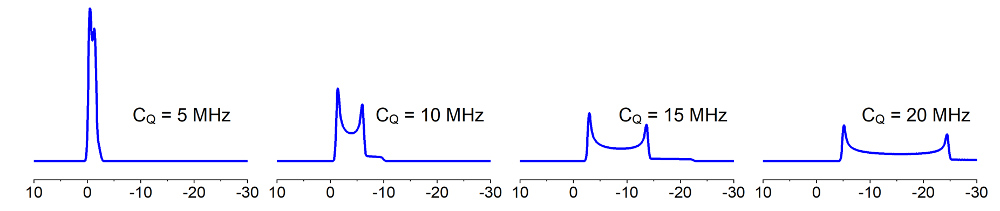

# Machine learning prediction of <sup>27</sup>Al ss-NMR C<sub>Q</sub> for crystalline materials

In the field of solid-state Nuclear Magnetic Resonance (NMR), materials are measured to yield critical parameters which can be used to detect the local geometry of the subject structure. A popular example is the isotropic chemical shift which is widely used to determine the structural difference between difference chemical sites for both solid-state and liquid-state materials. For solid materials specifically, there are more parameters than isotropic chemical shift that people can get from the NMR spectrums because of the remaining many body interactions such as dipolar interactions and quadrupolar interactions.

Experimentally quadrupolar interactions can be measure in terms of a value called the quadrupolar coupling constant (C<sub>Q</sub>). C<sub>Q</sub> is a value derived from the electronic field gradient (EFG) tensor and is directly correlated to the broadening of the spectrum.



**Figure 1** NMR spectrum with difference value of C<sub>Q</sub>

The goal of this model is to predict the C<sub>Q</sub> value from electronic field gradient (EFG) tensor of <sup>27</sup>Al containing solid materials.

# Table Of Contents
-  [Requirements](#requirements)
-  [Installation](#installation)
-  [Demonstration](#demonstration)
-  [License](#license)

# Requirements
The model is running on windows linux subsystem (WLS2).
The core functionalities of the model depends on the following packages:

```
dscribe==1.1.0
joblib==1.0.1
matminer==0.7.4
matplotlib==3.4.3
numpy==1.20.3
pandas==1.3.2
pymatgen==2022.0.14
scikit_learn==1.1.2
scipy==1.7.1
seaborn==0.11.2
tqdm==4.62.2
xgboost==1.5.0
```

# Installation

- First in terminal create a conda environment using the following command:

```
$ conda create -n myenv python=3.8
$ conda activate myenv
```

- Pull the repository from github:

```
$ git clone https://github.com/wushanyun64/27Al_CQ_prediction.git
```
- Install the dependencies from requirement.txt

```
$ pip install requirements.txt
```

# Demonstration

- previously trained model can be tested on the small demonstration data in `./example/` file,
`cd` to the exmaple file and run it to see the result.

```
$ python example.py
```

- Users are also encouraged to modify the example.py file for their own needs.

To fully explore the total training process, please refer to the `notebooks`.

# License

This project is covered under the **MIT License**.
