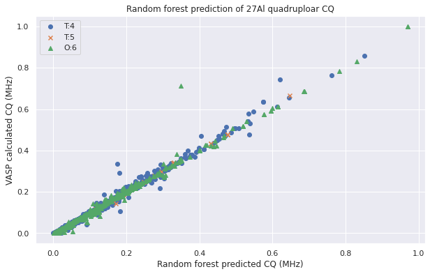
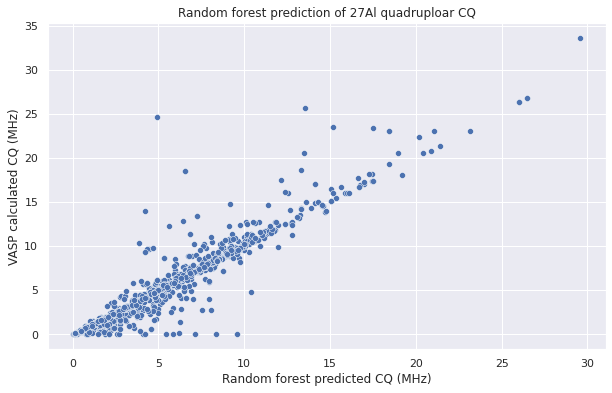

# Random Forest prediction of 27Al ss-NMR CQ for crystalline materials 

--------------------------------------------------------------------------------------------

## Introduction

The goal of this model is to predict the CQ value from electronic field gradient (EFG) tensor of 27Al containing solid materials. The algorithm chosen here is random forest and the model is trained on a dataset of totally around 1800 structures.  

The structures are transformed into two sets of features for the sub-stream of model training, the structural features and the elemental properties features. It is showed that the model based on our features managed to predict the CQ value for the test set with R2=0.97 and RMSE = 0.7 MHz which beats the model based on SOAP (R2=0.92).  

Here are the prediction results for this model and SOAP model.  

**Figure 1** Random forest prediction of CQ with the features from this work.  

**Figure 2** Random forest prediction of CQ with SOAP.  
