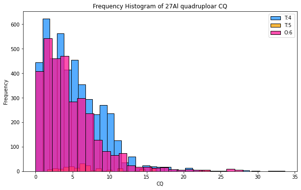

# Machine learning prediction of 27Al ss-NMR CQ for crystalline materials 

--------------------------------------------------------------------------------------------

## Introduction

In the field of solid-state Nuclear Magnetic Resonance (NMR), materials are measured to yield critical parameters which can be used to detect the local geometry of the subject structure. A popular example is the isotropic chemical shift which is widely used to determine the structural difference between difference chemical sites for both solid-state and liquid-state materials. For solid materials specifically, there are more parameters than isotropic chemical shift that people can get from the NMR spectrums because of the remaining many body interactions such as dipolar interactions and quadrupolar interactions. 

Experimentally quadrupolar interactions can be measure in terms of a value called the quadrupolar coupling constant (CQ). CQ is a value derived from the electronic field gradient (EFG) tensor and is directly correlated to the broadening of the spectrum.

**Figure 1** NMR spectrum with difference value of CQ

The goal of this model is to predict the CQ value from electronic field gradient (EFG) tensor of 27Al containing solid materials. 

## Dataset

The dataset for the training was obtained from the Materials Project[1]. The dataset is consist of 1800 27Al containing structures of 4, 5 and 6 coordination. Most Al materials have a local geometry of tetrahedron (T:4), trigonal-bipyramidical (T:5) or octahedral (O:6), thus these are the geometries considered in this dataset. The distribution of geometries is showed below:

**Figure 2** Geometry distribution of the 27Al dataset. 

All the structures in the dataset was accompanied with density functional theory (DFT) calculated NMR parameters for all sites, the calculations were perform with VASP[2] in a high-throughput manner. 

## Feature generation 

The structures are transformed into two sets of features for the sub-stream of model training, the structural features and the elemental properties features. *More details will be added later.* 

## Result

To assess the performance of the features and the overall accuracy of the model, we also included a benchmarking model based on the popular feature Smooth Overlap of Atomic Positions (SOAP)[3]. 

It is showed that the model based on our features managed to predict the CQ value for the test set with R2=0.97 and RMSE = 0.7 MHz which is a better result compared with the model based on SOAP (R2=0.92).  

Here are the prediction results for this model and SOAP model on the test set.  

**Figure 3** Random forest prediction of CQ with the features from this work.  

**Figure 4** Random forest prediction of CQ with SOAP. 

### References

* [1]: https://materialsproject.org/

* [2]: https://www.vasp.at/

* [3]: https://singroup.github.io/dscribe/0.3.x/tutorials/soap.html