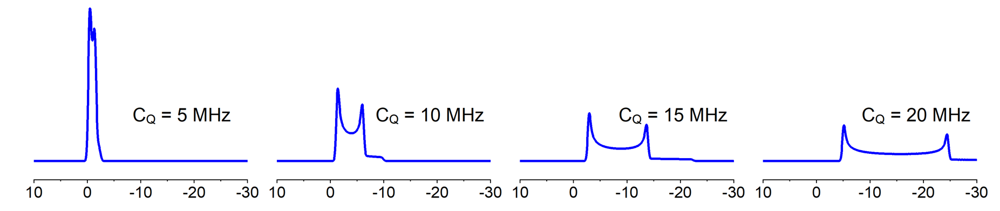

# Machine learning prediction of <sup>27</sup>Al ss-NMR C<sub>Q</sub> for crystalline materials

In the field of solid-state Nuclear Magnetic Resonance (NMR), materials are measured to yield critical parameters which can be used to detect the local geometry of the subject structure. A popular example is the isotropic chemical shift which is widely used to determine the structural difference between difference chemical sites for both solid-state and liquid-state materials. For solid materials specifically, there are more parameters than isotropic chemical shift that people can get from the NMR spectrums because of the remaining many body interactions such as dipolar interactions and quadrupolar interactions.

Experimentally quadrupolar interactions can be measure in terms of a value called the quadrupolar coupling constant (C<sub>Q</sub>). C<sub>Q</sub> is a value derived from the electronic field gradient (EFG) tensor and is directly correlated to the broadening of the spectrum.



**Figure 1** NMR spectrum with difference value of C<sub>Q</sub>

The goal of this model is to predict the C<sub>Q</sub> value from electronic field gradient (EFG) tensor of <sup>27</sup>Al containing solid materials.

# Requirements
The core functionalities of the model depends on the following packages:
- [scikit-learn](https://scikit-learn.org/stable/)
- [pymatgen](https://pymatgen.org/)
The rest of the dependencies could be found in requirements.txt.

# Table Of Contents
-  [How to use](#how-to-use)
-  [In Details](#in-details)
-  [Future Work](#future-work)
-  [Contributing](#contributing)
-  [Acknowledgments](#acknowledgments)

# How to use

- In `modeling`  folder create a python file named whatever you like, here we named it `example_model.py` . In `modeling/__init__.py` file, you can build a function named `build_model` to call your model

```python
from .example_model import ResNet18

def build_model(cfg):
    model = ResNet18(cfg.MODEL.NUM_CLASSES)
    return model
```


- In `engine`  folder create a model trainer function and inference function. In trainer function, you need to write the logic of the training process, you can use some third-party library to decrease the repeated stuff.

```python
# trainer
def do_train(cfg, model, train_loader, val_loader, optimizer, scheduler, loss_fn):
 """
 implement the logic of epoch:
 -loop on the number of iterations in the config and call the train step
 -add any summaries you want using the summary
 """
pass

# inference
def inference(cfg, model, val_loader):
"""
implement the logic of the train step
- run the tensorflow session
- return any metrics you need to summarize
 """
pass
```

- In `tools`  folder, you create the `train.py` .  In this file, you need to get the instances of the following objects "Model",  "DataLoader”, “Optimizer”, and config
```python
# create instance of the model you want
model = build_model(cfg)

# create your data generator
train_loader = make_data_loader(cfg, is_train=True)
val_loader = make_data_loader(cfg, is_train=False)

# create your model optimizer
optimizer = make_optimizer(cfg, model)
```

- Pass the all these objects to the function `do_train` , and start your training
```python
# here you train your model
do_train(cfg, model, train_loader, val_loader, optimizer, None, F.cross_entropy)
```

**You will find a template file and a simple example in the model and trainer folder that shows you how to try your first model simply.**


# In Details
```
├──  config
│    └── defaults.py  - here's the default config file.
│
│
├──  configs
│    └── train_mnist_softmax.yml  - here's the specific config file for specific model or dataset.
│
│
├──  data
│    └── datasets  - here's the datasets folder that is responsible for all data handling.
│    └── transforms  - here's the data preprocess folder that is responsible for all data augmentation.
│    └── build.py  		   - here's the file to make dataloader.
│    └── collate_batch.py   - here's the file that is responsible for merges a list of samples to form a mini-batch.
│
│
├──  engine
│   ├── trainer.py     - this file contains the train loops.
│   └── inference.py   - this file contains the inference process.
│
│
├── layers              - this folder contains any customed layers of your project.
│   └── conv_layer.py
│
│
├── modeling            - this folder contains any model of your project.
│   └── example_model.py
│
│
├── solver             - this folder contains optimizer of your project.
│   └── build.py
│   └── lr_scheduler.py
│
│
├──  tools                - here's the train/test model of your project.
│    └── train_net.py  - here's an example of train model that is responsible for the whole pipeline.
│
│
└── utils
│    ├── logger.py
│    └── any_other_utils_you_need
│
│
└── tests					- this foler contains unit test of your project.
     ├── test_data_sampler.py
```


# Future Work

# Contributing
Any kind of enhancement or contribution is welcomed.


# Acknowledgments
